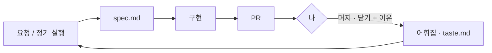

# react-playground

모션 · 인터랙션을 **말로 표현하는 방법**을 기록하고, 그 기록을 재료로 AI가
새 모션을 제안 · 구현하는 저장소.

- **요청 모드** — 작업하다가 `/motion 버튼이 자석처럼 끌려오게`처럼 일상어로 요청하면 스펙과 변형 2~3개까지 만들고, 그중 고른다
- **자율 모드** — 이 Mac의 `launchd`가 화 · 금 09:00에 `scripts/ideator.sh`를 실행해, AI가 어휘집의 빈 곳을 채우는 모션을 제안하고 PR로 올린다 (클라우드 실행 없음)
- 사람은 PR을 로컬에서 확인하고 **머지(채택) / 닫기(거절) + 이유 한 줄**만 남긴다



전체 흐름(시퀀스 다이어그램), 역할, 파일 구조, 가드레일은
**[docs/WORKFLOW.md](docs/WORKFLOW.md)** 에 있다.

## Stack

React 19 · Vite · TypeScript · Tailwind v4 · framer-motion · TanStack Query / Table · Radix

## 실행

```bash
pnpm install
pnpm dev
```
