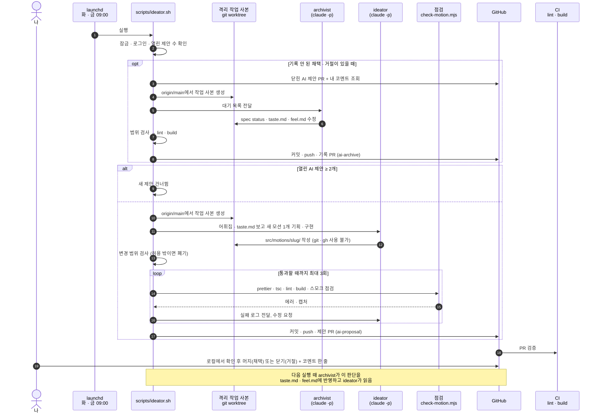

# Workflow

이 저장소가 굴러가는 방식. 모션을 **말로 표현하는 방법**을 기록하고, 그 기록을
재료로 AI가 새 모션을 제안·구현한다. 사람은 방향을 주고 결과를 고른다.
모든 AI 실행은 **이 Mac에서만** 일어난다 (클라우드 실행 없음).

## 두 가지 모드

| 모드      | 시작                                                  | 하는 일                                       | 사람이 하는 일                                     |
| --------- | ----------------------------------------------------- | --------------------------------------------- | -------------------------------------------------- |
| 요청 모드 | `/motion 버튼이 자석처럼 끌려오게`                    | spec · 구현 · 점검까지 대화 안에서            | 결과를 보고 고칠 말, 채택 · 거절                   |
| 자율 모드 | `launchd`가 화 · 금 09:00에 `scripts/ideator.sh` 실행 | 어휘집의 빈 곳을 채우는 모션을 혼자 제안 → PR | PR을 보고 **머지(채택) / 닫기(거절)** + 이유 한 줄 |

## 자율 모드 한눈에 보기



요청 모드는 같은 구성요소를 대화 안에서 쓴다. `/motion` 스킬이 같은 규칙(spec 형식 · 주석 · 점검)으로 구현하고, 채택 · 거절도 바로 기록한다.

## 등장 요소

| 이름         | 종류            | 역할                                                                            | 위치                                                          |
| ------------ | --------------- | ------------------------------------------------------------------------------- | ------------------------------------------------------------- |
| launchd      | macOS           | 정해진 시각에 스크립트 실행                                                     | `~/Library/LaunchAgents/local.react-playground.ideator.plist` |
| ideator.sh   | 스크립트        | 잠금 · 점검 · 작업 사본 · 재시도 · 커밋 · push · PR 전부 담당                   | `scripts/ideator.sh`                                          |
| ideator      | claude 에이전트 | 새 모션 기획 · 구현. 파일만 수정                                                | `.claude/agents/ideator.md`                                   |
| archivist    | claude 에이전트 | 채택 · 거절을 spec · taste.md · feel.md에 반영                                  | `.claude/agents/archivist.md`                                 |
| check-motion | 스크립트        | 상세 페이지를 headless Chrome으로 열어 에러 · 렌더링 확인, 스크롤 · 포인터 캡처 | `scripts/check-motion.mjs`                                    |
| CI           | GitHub Actions  | PR마다 `lint` · `build`                                                         | `.github/workflows/ci.yml`                                    |
| 나           | 사람            | 요청, 머지 / 닫기, 이유 코멘트                                                  | —                                                             |

설계에 있던 critic 에이전트는 두지 않았다. "스펙대로 나왔는가"는 LLM 리뷰 대신 기계 점검(`check-motion`)과 사람의 확인으로 대체한다.

## 파일 구조

```
vocabulary/
  triggers.md      in-view, cursor-follow, hover, press, drag, scroll-linked …
  properties.md    translate, rotate, scale, clip-path, opacity …
  timing.md        ease-out-quart, spring, stagger, scroll-distance …
  feel.md          요청에 쓴 말 ↔ 수치 ("통 튕기는" = spring 220 / 12 …), 확인됨 | 가설
taste.md           채택 · 거절 사유 로그
src/motions/<slug>/
  spec.md          frontmatter (origin · status · 어휘 태그 · hooks) + 요청 · 수치 · 메모
  Motion.tsx       생성된 컴포넌트 (한 파일)
  demo.tsx         갤러리에 띄울 사용 예시
.claude/
  skills/motion/   요청 모드 (/motion)
  agents/          ideator · archivist (자율 모드)
scripts/
  ideator.sh               자율 모드 진입점
  check-motion.mjs         스모크 점검 (npm run motion:check -- <slug>)
  autonomous/install.sh    launchd 등록 · 해제 · 상태 · 즉시 실행
  autonomous/pending-archive.mjs   기록 안 된 채택 · 거절 조회
```

spec 형식은 [`src/motions/README.md`](../src/motions/README.md)를 따른다.
갤러리는 `import.meta.glob`으로 `src/motions/*`를 읽는다. 폴더 하나 추가로
등록이 끝나므로 에이전트가 사이드바 · 라우터 코드를 건드리지 않는다.

## 가드레일

실행 환경

- **Claude는 로컬 PC에서만 실행한다.** 클라우드 세션 · 원격 에이전트 · 외부 배포를 쓰지 않고, 커밋 · PR에 `claude.ai/code/session` 링크를 남기지 않는다
- **사용자 작업 폴더를 건드리지 않는다.** 매 실행마다 `~/.cache/react-playground-ideator/worktree`에 격리된 작업 사본을 만들고, 끝나면 지운다. 작업 중이던 브랜치나 수정 중인 파일과 충돌하지 않는다
- 동시 실행 방지(잠금), claude 1회 실행 25분 제한 (초과 시 자식 프로세스까지 종료)

claude의 권한

- **git · gh · rm · curl · 웹 접근 차단.** 파일 읽기 · 쓰기와 `npm run` · `tsc` · `prettier` · `check-motion`만 허용
- 커밋 · push · PR은 스크립트가 한다. claude는 원격에 닿을 수 없다
- 수정 가능 범위 밖의 변경이 하나라도 있으면 통째로 폐기 (ideator: `src/motions/<새 slug>/`, `vocabulary/*.md` / archivist: `spec.md`의 status, `taste.md`, `feel.md`)

결과물

- main 직접 push 금지. 모든 변경은 feature 브랜치 → PR
- **머지는 사람만** 한다
- 열린 AI 제안 PR이 2개면 새 제안을 쉰다
- 새 의존성 추가 금지
- 점검(`prettier` · `tsc` · `lint` · `build` · `check-motion`)이 3회 안에 통과하지 못하면 아무것도 올리지 않고 로그만 남긴다
- 커밋 작성자는 저장소 설정(soma0078)으로 고정한다

## 구현 상태

| 단계 | 내용                                                                              | 상태                                                                     |
| ---- | --------------------------------------------------------------------------------- | ------------------------------------------------------------------------ |
| 1    | `src/motions/` 구조, 갤러리 자동 등록, 상세 페이지, 어휘집 초안, AI 제안 모션 3종 | ✅                                                                       |
| 2    | `/motion` 스킬 + 변형 비교 · 고르기                                               | ✅                                                                       |
| 3    | CI (GitHub Actions) + 스모크 점검 `check-motion` (영상 대신 단계별 캡처)          | ✅                                                                       |
| 4    | 에이전트 2종 (`ideator` · `archivist`) + `ideator.sh` 오케스트레이션              | ✅                                                                       |
| 5    | `launchd` 등록 (화 · 금 09:00)                                                    | 🟡 코드 완료, **등록은 사용자가 직접** (`scripts/autonomous/install.sh`) |

## 직접 확인하기

```bash
npm run build && npm run motion:check -- <slug>      # 모션 하나 점검 (캡처: .motion-shots/<slug>/)
scripts/ideator.sh --dry-run                         # 지금 실행하면 무슨 일을 할지 출력만
NO_PUSH=1 scripts/ideator.sh                         # 실제 1회 실행, 커밋까지만 (push · PR 없음)
scripts/ideator.sh                                   # 실제 1회 실행 (PR까지)
scripts/autonomous/install.sh                        # launchd 등록
scripts/autonomous/install.sh --status               # 등록 여부 · 마지막 실행 결과 · 로그
scripts/autonomous/install.sh --run-now              # launchd 환경에서 지금 즉시 실행
scripts/autonomous/install.sh --uninstall            # 해제
```

로그: `~/Library/Logs/react-playground-ideator.log`
