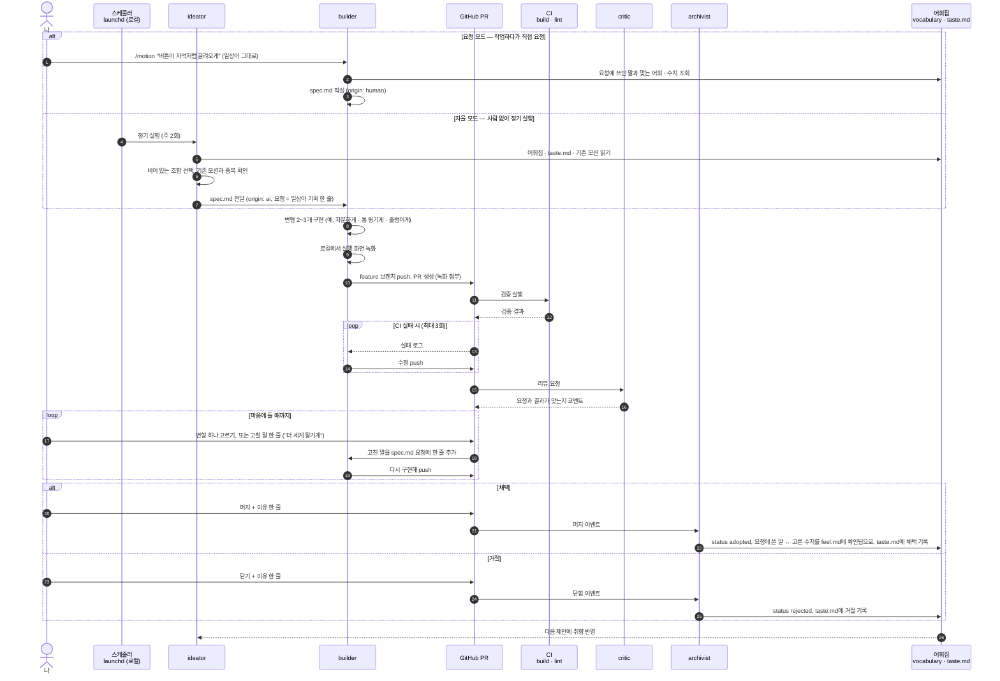

# Workflow

이 저장소가 굴러가는 방식. 모션을 **말로 표현하는 방법**을 기록하고, 그 기록을
재료로 AI가 새 모션을 제안·구현한다. 사람은 방향을 주고 결과를 고른다.

> 이 문서는 **목표 설계**다. 각 단계의 구현 여부는 아래 [구현 상태](#구현-상태)를 본다.

## 한눈에 보기



사람이 하는 일은 세 가지다. **일상어로 요청하기**(선택), **변형 고르기 또는 고칠 말 한 줄**,
**머지 / 닫기 + 이유 한 줄**. 수치는 처음부터 끝까지 AI가 다룬다.
요청에 쓴 말과 고른 수치가 `feel.md`에 짝지어져 쌓일수록 같은 말이 같은 결과를 낸다.

## 등장 요소

| 이름      | 역할                                  | 읽는 것                                            | 쓰는 것                      |
| --------- | ------------------------------------- | -------------------------------------------------- | ---------------------------- |
| 나        | 요청, 최종 판단                       | PR 녹화 · 로컬 `pnpm dev`                          | 머지 / 닫기 사유             |
| 스케줄러  | 자율 모드 트리거 (로컬 `launchd`)     | —                                                  | —                            |
| ideator   | 어휘 조합으로 새 모션 기획            | `vocabulary/`, `taste.md`, `src/motions/*/spec.md` | 새 `spec.md`                 |
| builder   | 스펙대로 구현하고 PR 생성             | `spec.md`, `vocabulary/`                           | `Motion.tsx`, `demo.tsx`, PR |
| CI        | 기계 검증 (GitHub Actions)            | PR 브랜치                                          | 체크 결과                    |
| critic    | 스펙 대비 결과 리뷰 (코드 수정 안 함) | PR diff, 영상                                      | PR 코멘트                    |
| archivist | 결과를 어휘집에 환류                  | 머지 / 닫힌 PR                                     | `vocabulary/`, `taste.md`    |

## 파일 구조

```
vocabulary/
  triggers.md      in-view, cursor-follow, hover, press, drag, scroll-triggered …
  properties.md    translate, rotate, scale, clip-path, opacity …
  timing.md        ease-out-quart, spring, stagger, split-timing …
  feel.md          요청에 쓴 말 ↔ 수치 ("통 튕기는" = spring 220 / 12 …), 확인됨 | 가설
taste.md           채택 · 거절 사유 로그
src/motions/<slug>/
  spec.md          frontmatter (origin · status · 어휘 태그) + 요청 · 수치 · 메모
  Motion.tsx       생성된 컴포넌트 (한 파일)
  demo.tsx         갤러리에 띄울 사용 예시
```

spec 형식은 [`src/motions/README.md`](../src/motions/README.md)를 따른다.
갤러리는 `import.meta.glob`으로 `src/motions/*`를 읽는다. 폴더 하나 추가로
등록이 끝나므로 에이전트가 사이드바 · 라우터 코드를 건드리지 않는다.

## 가드레일

- **Claude는 로컬 PC에서만 실행한다.** 클라우드 세션 · 원격 에이전트 · 외부 배포를 쓰지 않고, 커밋 · PR에 `claude.ai/code/session` 링크를 남기지 않는다
- main 직접 push 금지. 모든 변경은 feature 브랜치 → PR
- **머지는 사람만** 한다 (브랜치 보호: PR + CI 통과 + 승인 1)
- AI 제안 PR은 동시에 최대 2개. 열린 PR이 2개면 ideator는 쉰다
- 새 의존성 추가 금지 (요청 모드에서 명시한 경우 제외)
- CI 수정 재시도는 최대 3회. 넘으면 PR에 실패 사유를 남기고 멈춘다

## 구현 상태

| 단계 | 내용                                                                                                       | 상태 |
| ---- | ---------------------------------------------------------------------------------------------------------- | ---- |
| 1    | `src/motions/` 구조, 갤러리 자동 등록, 상세 페이지(요청 → 실행 화면 → 수치), 어휘집 초안, AI 제안 모션 3종 | ✅   |
| 2    | `/motion` 스킬 (`.claude/skills/motion/`) + 변형 2~3개 비교 · 고르기                                       | ✅   |
| 3    | CI (GitHub Actions: build · lint) + 로컬 녹화 스크립트 (headless 브라우저로 상세 페이지 캡처 · 영상)       | ⬜   |
| 4    | 에이전트 4종 (`.claude/agents/`), 로컬에서 `claude -p`로 실행                                              | ⬜   |
| 5    | `launchd`로 ideator 정기 실행 (자율 모드, 예: 화 · 금 09:00, Mac이 켜져 있을 때)                           | ⬜   |
