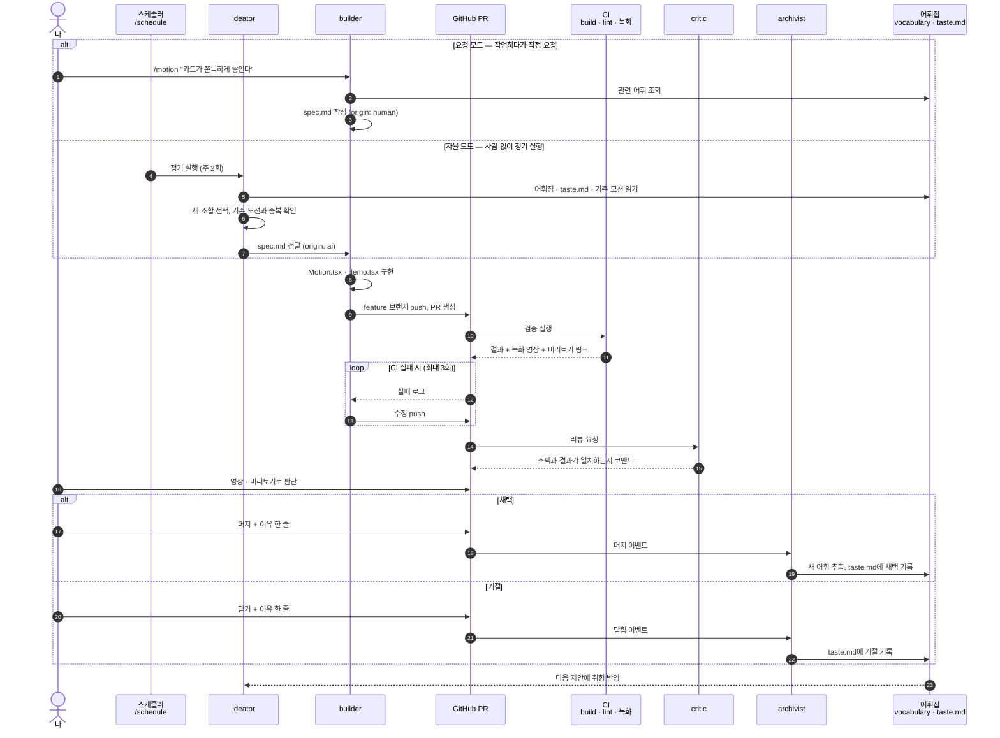

# Workflow

이 저장소가 굴러가는 방식. 모션을 **말로 표현하는 방법**을 기록하고, 그 기록을
재료로 AI가 새 모션을 제안·구현한다. 사람은 방향을 주고 결과를 고른다.

> 이 문서는 **목표 설계**다. 각 단계의 구현 여부는 아래 [구현 상태](#구현-상태)를 본다.

## 한눈에 보기



사람이 하는 일은 두 가지뿐이다. **요청하기**(선택)와 **머지 / 닫기 + 이유 한 줄**.
마지막 이유 한 줄이 `taste.md`에 쌓여야 자율 모드가 점점 취향에 맞아진다.

## 등장 요소

| 이름      | 역할                                  | 읽는 것                                            | 쓰는 것                       |
| --------- | ------------------------------------- | -------------------------------------------------- | ----------------------------- |
| 나        | 요청, 최종 판단                       | PR 영상 · 미리보기                                 | 머지 / 닫기 사유              |
| 스케줄러  | 자율 모드 트리거 (`/schedule` 루틴)   | —                                                  | —                             |
| ideator   | 어휘 조합으로 새 모션 기획            | `vocabulary/`, `taste.md`, `src/motions/*/spec.md` | 새 `spec.md`                  |
| builder   | 스펙대로 구현하고 PR 생성             | `spec.md`, `vocabulary/`                           | `Motion.tsx`, `demo.tsx`, PR  |
| CI        | 기계 검증 + 실행 화면 녹화            | PR 브랜치                                          | 체크 결과, 영상, 미리보기 URL |
| critic    | 스펙 대비 결과 리뷰 (코드 수정 안 함) | PR diff, 영상                                      | PR 코멘트                     |
| archivist | 결과를 어휘집에 환류                  | 머지 / 닫힌 PR                                     | `vocabulary/`, `taste.md`     |

## 파일 구조

```
vocabulary/
  triggers.md      load, hover, scroll-linked, scroll-triggered, drag, cursor-follow …
  properties.md    scale, translate, clip-path, blur, path morph, layout …
  timing.md        duration, easing, spring 파라미터, stagger
  feel.md          형용사 ↔ 파라미터 ("쫀득한" = spring stiffness 400 / damping 15 …)
taste.md           채택 · 거절 사유 로그
src/motions/<slug>/
  spec.md          묘사, 사용한 어휘, 프롬프트, origin (human | ai), status
  Motion.tsx       생성된 컴포넌트
  demo.tsx         갤러리에 띄울 사용 예시
```

갤러리는 `import.meta.glob`으로 `src/motions/*`를 읽는다. 폴더 하나 추가로
등록이 끝나므로 에이전트가 사이드바 · 라우터 코드를 건드리지 않는다.

## 가드레일

- main 직접 push 금지. 모든 변경은 feature 브랜치 → PR
- **머지는 사람만** 한다 (브랜치 보호: PR + CI 통과 + 승인 1)
- AI 제안 PR은 동시에 최대 2개. 열린 PR이 2개면 ideator는 쉰다
- 새 의존성 추가 금지 (요청 모드에서 명시한 경우 제외)
- CI 수정 재시도는 최대 3회. 넘으면 PR에 실패 사유를 남기고 멈춘다

## 구현 상태

| 단계 | 내용                                                                             | 상태 |
| ---- | -------------------------------------------------------------------------------- | ---- |
| 1    | `src/motions/` 구조, 갤러리 자동 등록, 기존 데모 → `spec.md` 역기술, 어휘집 초안 | ⬜   |
| 2    | `/motion` 스킬 (요청 모드)                                                       | ⬜   |
| 3    | CI (build · lint) + Playwright 녹화 + PR 미리보기 배포                           | ⬜   |
| 4    | 에이전트 4종 (`.claude/agents/`) + `claude-code-action` 연결                     | ⬜   |
| 5    | `/schedule`로 ideator 정기 실행 (자율 모드)                                      | ⬜   |
